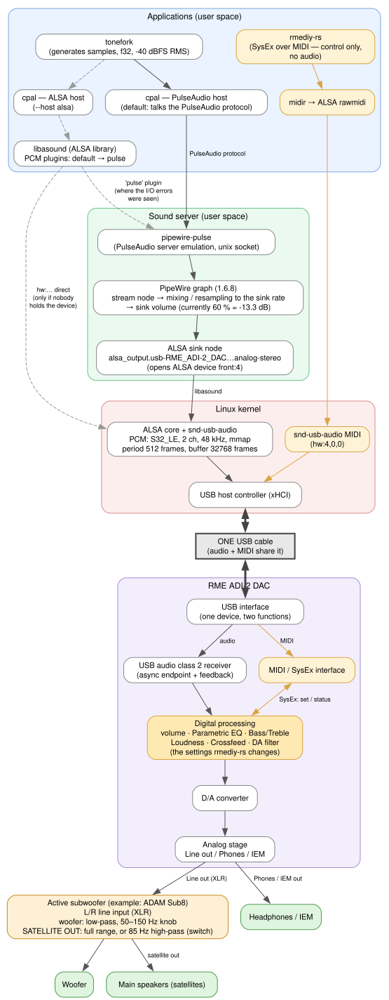
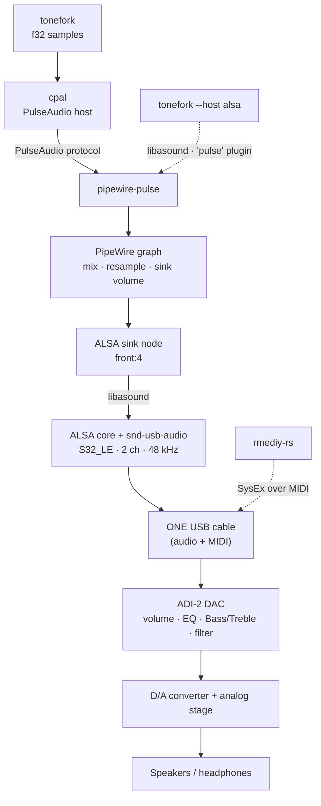

# From `tonefork` to the speakers

What the audio goes through on a typical Linux desktop with an RME ADI-2 DAC (PipeWire, USB).
Measured values (PipeWire 1.6.8, S32_LE / 48 kHz / period 512) come from one machine and will differ on yours.



The same thing in a simplified form (rendered natively by GitHub):



## The layers

| Layer | Role |
|---|---|
| **tonefork** | Generates the samples (floating point, scaled to a given RMS level). |
| **cpal** | Audio I/O library. Its *PulseAudio* host speaks the PulseAudio protocol (no ALSA involved); its *ALSA* host goes through `libasound`. |
| **pipewire-pulse** | Lets PulseAudio clients talk to PipeWire. |
| **PipeWire** | The sound server: mixes the streams of all applications, resamples them to the device's rate, applies the **sink volume**. |
| **ALSA sink node** | PipeWire's output to the hardware. It opens the ALSA device (`front:4` here) through `libasound`. |
| **Kernel: ALSA core + `snd-usb-audio`** | The driver. Exposes the DAC as a sound card, with a memory-mapped ring buffer (here 512-frame periods, 32768-frame buffer). |
| **USB (one cable)** | A single physical cable carries both the audio (USB audio class 2: isochronous transfers, the DAC's clock drives the rate through a feedback endpoint) and the MIDI. The DAC separates them internally. |
| **ADI-2 DAC** | Receives the stream, applies its **own** processing (volume, parametric EQ, Bass/Treble, loudness, crossfeed, filter), converts to analog. |

## Two paths to keep in mind

- **Default (`--host pulse`)**: `tonefork → cpal → pipewire-pulse → PipeWire → ALSA → USB`.
- **`--host alsa`**: `tonefork → cpal → libasound`. `libasound` then either goes through its `pulse` plugin to PipeWire (the path where spurious `snd_pcm_avail_delay` I/O errors were seen), or opens the hardware directly (`hw:…`), which only works if nobody else (PipeWire) holds the device.

## Control is separate from audio

`rmediy-rs` never touches the audio: it sends SysEx messages over **MIDI** (`midir` → ALSA rawmidi → `snd-usb-audio` → the same USB cable) to change the DAC's internal processing. That is why an EQ change made in `rmediy-rs` is audible in whatever you play, whichever audio path it takes.

## Three volume stages

What you hear is the product of three independent gains:

1. the application's level (`tonefork --level`, `-40 dBFS` by default);
2. PipeWire's **sink volume** (a software gain, e.g. 60 % ≈ -13 dB on the sink of this machine);
3. the DAC's own volume (and its EQ, Bass/Treble, loudness...).

Remember this when a signal seems "too quiet" or "too loud", and when comparing settings: change only one of them at a time.

## Check it on your machine

```sh
pactl list short sinks                       # sinks known to PipeWire
pw-dump | less                               # the PipeWire graph
cat /proc/asound/cards                       # ALSA cards
cat /proc/asound/card4/stream0               # formats and rates the DAC offers (card number may differ)
cat /proc/asound/card4/pcm0p/sub0/hw_params  # what is negotiated right now while something plays
```
