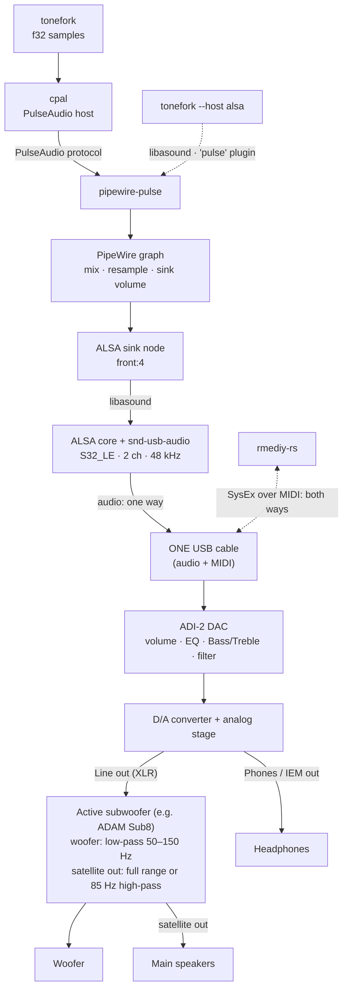

# From `tonefork` to the speakers

What the audio goes through on a typical Linux desktop with an RME ADI-2 DAC (PipeWire, USB).
Measured values (PipeWire 1.6.8, S32_LE / 48 kHz / period 512) come from one machine and will differ on yours.


The same thing in a simplified form (rendered natively by GitHub):



## The layers

| Layer | Role |
|---|---|
| **tonefork** | Generates the samples (floating point, scaled to a given RMS level). |
| **cpal** | Audio I/O library. Its *PulseAudio* host speaks the PulseAudio protocol (no ALSA involved); its *ALSA* host goes through `libasound`. |
| **pipewire-pulse** | Lets PulseAudio clients talk to PipeWire. |
| **PipeWire** | The sound server: mixes the streams of all applications, resamples them to the device's rate, applies the **sink volume**. |
| **ALSA sink node** | PipeWire's output to the hardware. It opens the ALSA device (`front:4` here) through `libasound`. |
| **Kernel: ALSA core + `snd-usb-audio`** | The driver. Exposes the DAC as a sound card, with a memory-mapped ring buffer (here 512-frame periods, 32768-frame buffer). |
| **USB (one cable)** | A single physical cable carries both the audio and the MIDI; the DAC separates them internally. The **audio is one-way** (PC → DAC: isochronous transfers, USB audio class 2; the only thing coming back is a small rate-feedback message, because the DAC's clock drives the rate). The **MIDI is two-way**: `rmediy-rs` sends settings and the DAC reports its state. |
| **ADI-2 DAC** | Receives the stream, applies its **own** processing (volume, parametric EQ, Bass/Treble, loudness, crossfeed, filter), converts to analog. |

## Two paths to keep in mind

- **Default (`--host pulse`)**: `tonefork → cpal → pipewire-pulse → PipeWire → ALSA → USB`.
- **`--host alsa`**: `tonefork → cpal → libasound`. `libasound` then either goes through its `pulse` plugin to PipeWire (the path where spurious `snd_pcm_avail_delay` I/O errors were seen), or opens the hardware directly (`hw:…`), which only works if nobody else (PipeWire) holds the device.

## Control is separate from audio

`rmediy-rs` never touches the audio: it sends SysEx messages over **MIDI** (`midir` → ALSA rawmidi → `snd-usb-audio` → the same USB cable) to change the DAC's internal processing. That is why an EQ change made in `rmediy-rs` is audible in whatever you play, whichever audio path it takes.

## An example of analog chain: an active subwoofer

Everything above ends at the DAC's analog outputs. What follows depends on your gear. A common one: the Line Out (XLR) goes to an **active subwoofer**, and the main speakers ("satellites") are fed from the subwoofer's outputs. For the ADAM Sub8, its [manual](https://www.adam-audio.com/content/uploads/2018/03/adam-audio-sub8-subwoofer-user-manual-en-de.pdf) says:

- The source's left and right line outputs go to the subwoofer's **L/R inputs** (XLR or RCA); the main speakers connect to its **L/R SATELLITE OUT**. The manual recommends, if possible, sending the main signal into the subwoofer and connecting the satellites to its output.
- The **Frequency** knob sets the upper limit of the subwoofer, **50 to 150 Hz** (an 85 Hz marker is the Dolby recommendation for surround; ADAM suggests 70–75 Hz, as the -3 dB point, for typical near-field monitors).
- The **Satellite Filter** switch chooses what the satellites receive: the signal **full range**, or **high-passed at 85 Hz**. That 85 Hz is a fixed value of the switch; it does not follow the Frequency knob.
- A **Phase** switch (0° / 180°) sets the woofer's polarity relative to the satellites; try it again whenever the frequency changes.
- The **Volume** knob is the input sensitivity (-60 to +6 dB relative to 775 mV on XLR).

The manual does not state the filter slopes.

What this means for tests: a signal below about 85 Hz is mostly reproduced by the woofer, so a band at 63 Hz tests the subwoofer, not the satellites, and its level also depends on the subwoofer's own Volume knob. The DAC's EQ and Bass/Treble act *before* the subwoofer, so their effect on the low end adds to the subwoofer's settings. The voice range (125 Hz and above) goes to the satellites.

## Three volume stages

What you hear is the product of independent gains:

1. the application's level (`tonefork --level`, `-40 dBFS` by default);
2. PipeWire's **sink volume** (a software gain, e.g. 60 % ≈ -13 dB on the sink of this machine);
3. the DAC's own volume (and its EQ, Bass/Treble, loudness...);
4. after the DAC, whatever the analog chain adds (for example a subwoofer's input sensitivity).

Remember this when a signal seems "too quiet" or "too loud", and when comparing settings: change only one of them at a time.

## Check it on your machine

```sh
pactl list short sinks                       # sinks known to PipeWire
pw-dump | less                               # the PipeWire graph
cat /proc/asound/cards                       # ALSA cards
cat /proc/asound/card4/stream0               # formats and rates the DAC offers (card number may differ)
cat /proc/asound/card4/pcm0p/sub0/hw_params  # what is negotiated right now while something plays
```
